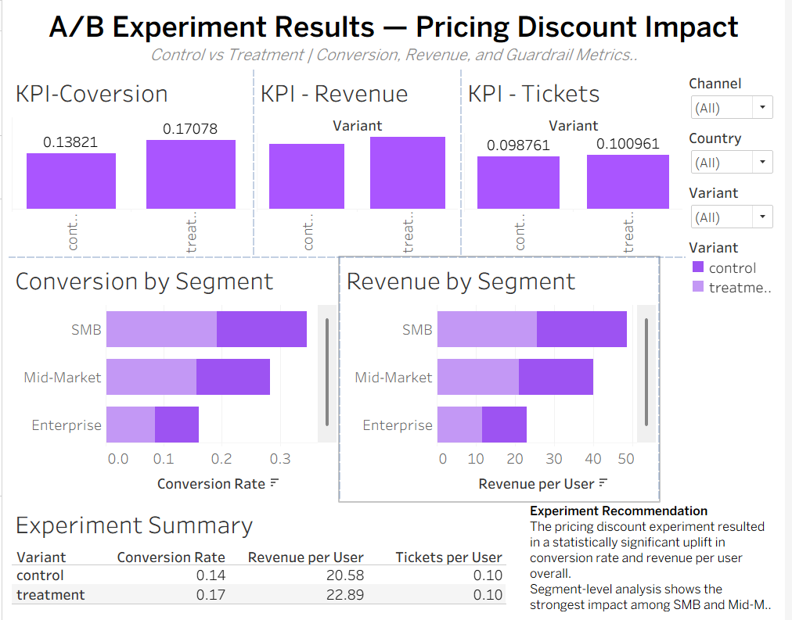

# 🔬 A/B Experimentation & Pricing Optimization Platform

> End-to-end A/B experiment analysis across 50,000 users — from data simulation and SQL modeling to statistical validation and executive dashboarding.

[](https://www.python.org/)
[](https://www.sqlite.org/)
[](https://public.tableau.com/)
[]()

---

## 📌 Project Summary

A business wanted to know: *does a limited-time pricing discount actually improve conversion — and for which customers?*

This project answers that question end-to-end: simulating a realistic enterprise A/B experiment, building a user-level analytics model in SQL, running statistical significance testing in Python, and delivering findings in an executive-ready Tableau dashboard.

**The result:** SMB and Mid-Market segments showed the strongest uplift from the discount. Enterprise customers showed minimal response — pointing to a more targeted rollout strategy.

---

## 📊 Dashboard Preview



---

## 🎯 Business Problem

| Question | Answer |
|---|---|
| Does the discount outperform standard pricing? | ✅ Yes — conversion rate and revenue per user both improved |
| Which segments respond best? | SMB and Mid-Market showed highest uplift |
| Any negative side effects? | ❌ No — support tickets per user were unchanged |
| Recommended rollout? | Selective: SMB + Mid-Market; separate experiment needed for Enterprise |

---

## 🧪 Experiment Design

| Parameter | Value |
|---|---|
| Control Group | Standard pricing |
| Treatment Group | Discounted pricing |
| Total Users | 50,000 |
| Primary KPI | Conversion Rate |
| Secondary KPI | Revenue per User |
| Guardrail Metric | Support Tickets per User |
| Statistical Method | Two-proportion z-test, p-value validation, uplift analysis |

---

## 🗂️ Project Structure

```
experimentation-analytics-platform/
│
├── data/                  # Simulated experiment dataset
├── notebooks/             # EDA and statistical analysis
├── src/                   # Python modules (simulation, stats testing)
├── dashboards/            # Tableau dashboard screenshot
└── README.md
```

---

## 🔄 Workflow

```
1. Data Simulation     →  Realistic user-level experiment data (users, orders, support tickets)
2. SQL Modeling        →  User-level experiment summary table in SQLite
3. Statistical Testing →  z-test, p-value validation, uplift analysis in Python
4. Segmentation        →  Control vs. treatment breakdown by customer tier
5. Dashboard           →  Executive-ready Tableau KPI dashboard with recommendations
```

---

## 📈 Key Results

- **Conversion rate improved** significantly in the treatment group vs. control
- **Revenue per user increased** without any rise in support tickets (guardrail held)
- **SMB segment** showed the highest conversion uplift — strongest ROI target
- **Mid-Market segment** also responded positively with meaningful revenue impact
- **Enterprise segment** showed minimal response — discount is not the right lever here

---

## 🛠️ Tech Stack

| Layer | Tools |
|---|---|
| Data Simulation | Python, NumPy, Pandas |
| Analytics Modeling | SQL (SQLite) |
| Statistical Testing | Python (SciPy, statsmodels) |
| Visualization | Tableau |
| Version Control | Git, GitHub |

---

## 🚀 How to Run

```bash
# Clone the repo
git clone https://github.com/RAKSHITHA-RAVI/experimentation-analytics-platform.git
cd experimentation-analytics-platform

# Install dependencies
pip install -r requirements.txt

# Run the analysis notebook
jupyter notebook notebooks/
```

---

## 💡 Business Recommendations

1. **Roll out the discount to SMB and Mid-Market segments** — statistically significant uplift with no guardrail violations
2. **Do not extend to Enterprise** — minimal conversion response; design a separate experiment with alternative incentives (e.g., onboarding support, SLA upgrades)
3. **Monitor revenue per user post-rollout** to confirm lift sustains at scale

---

## 🔗 Connect

**Rakshitha Ravishankar** — Data & AI Analyst  
[](https://www.linkedin.com/in/rakshitha-ravishankar29/)
[](https://github.com/RAKSHITHA-RAVI)
